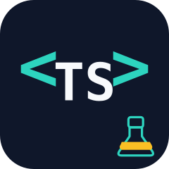

<p align="center">
  
</p>

<h1 align="center">ts-lab</h1>

<p align="center">
  <a href="https://www.npmjs.com/package/@bilibaba/ts-lab"></a>
  <a href="https://www.npmjs.com/package/@bilibaba/ts-lab"></a>
  <a href="https://bundlephobia.com/result?p=@bilibaba/ts-lab"></a>
  <a href="https://www.jsdocs.io/package/@bilibaba/ts-lab"></a>
  <a href="https://github.com/bibibala/ts-lab/blob/main/LICENSE"></a>
</p>

<p align="center">
  轻量、零依赖、TypeScript 优先的浏览器端工具库。
</p>

## ✨ Features

- **🪶 轻量零依赖** — 无第三方依赖，按模块引入，不拖累 bundle 体积
- **🔒 类型安全** — 完整的 TypeScript 类型定义，无需额外安装 `@types/*`
- **🌐 浏览器原生** — 基于 Clipboard API、Navigator、WebMCP 等现代浏览器能力
- **📦 模块化** — 按需导入，`@bilibaba/ts-lab/browser` / `bus` / `recursion` 独立入口

## 📖 文档

完整 API 文档请访问：**[ts-lab 文档站](https://ts-lab.netlify.app/)**

## 📦 安装

```bash
pnpm add @bilibaba/ts-lab
```

```ts
import { readText, writeText } from '@bilibaba/ts-lab/browser'

await writeText('Hello ts-lab!')
const text = await readText()
```

## License

[MIT](./LICENSE) License © [bibibala](https://github.com/bibibala)
